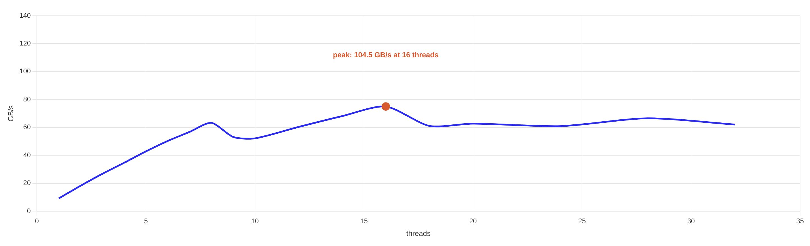

# BandwidthLab

An experimental playground for measuring and understanding memory bandwidth.

BandwidthLab is a small multithreaded C++ benchmark inspired by the classic
[STREAM benchmark](https://www.cs.virginia.edu/stream/). It measures sustained
memory bandwidth by timing four vector kernels over large arrays that don't
fit in cache:

| Kernel | Operation           | Bytes moved per element |
|--------|----------------------|--------------------------|
| Copy   | `c[j] = a[j]`         | 2 doubles (read + write) |
| Scale  | `b[j] = s * c[j]`     | 2 doubles (read + write) |
| Add    | `c[j] = a[j] + b[j]`  | 3 doubles (2 read + 1 write) |
| Triad  | `a[j] = b[j] + s * c[j]` | 3 doubles (2 read + 1 write) |

Each kernel is split evenly across a configurable number of `std::thread`
workers, run for several loop iterations, and reported with min/max/average
timings and best achieved bandwidth in MB/s.

## Requirements

- CMake >= 3.10
- A C++17 compiler (g++, clang++, etc.)

## Build

```bash
cmake -S . -B build
cmake --build build
```

This produces the `main` executable inside `build/`.

## Usage

```bash
./build/main [threads] [array_size] [loops]
```

| Argument     | Description                                   | Default |
|--------------|------------------------------------------------|---------|
| `threads`    | Number of worker threads per kernel             | `1`     |
| `array_size` | Number of `double` elements per array (a, b, c) | `1e8`   |
| `loops`      | Number of timed iterations per kernel           | `10`    |

The array size defaults to a value large enough that the working set exceeds
typical CPU caches, so the benchmark reflects main-memory bandwidth rather
than cache bandwidth. The first two iterations of each run are treated as a
"cold start" and excluded from the averaged statistics.

### Example

```bash
./build/main 4 100000000 10
```

Runs the benchmark with 4 threads, 100M-element arrays, over 10 iterations.

### Sample output

```
Function   Best Rate  Avg time    Min time  Max time
Copy:      12345.6    0.123456    0.123000  0.130000
Scale:     12000.1    0.126000    0.125000  0.128000
Add:       13500.4    0.170000    0.168000  0.172000
Triad:     13600.2    0.169000    0.167000  0.171000
-------------------------------------------------------------
```

- **Best Rate MB/s** — bandwidth computed from the fastest (min-time) iteration.
- **Avg/Min/Max time** — timing in seconds across the non-cold-start iterations.

## Benchmark results



Tested thread counts 1–32, each point from
`./build/main <threads> 100000000 10`. Bandwidth grows nearly linearly with
thread count until it saturates at the physical core count, topping out at
**~104.5 GB/s with 16 threads**. Beyond that, throughput plateaus and gets
noisier rather than improving.

Measured on:

| Component | Spec |
|-----------|------|
| CPU       | Intel Xeon Platinum 8573C, 1 socket, 8 cores / 16 threads (SMT2) |
| Memory    | 62 GiB RAM |
| OS        | Ubuntu 24.04.4 LTS, kernel 6.17.0-1018-azure |

This is an Azure-hosted VM, so results can include scheduling noise from the
hypervisor — expect some run-to-run variance, especially at higher thread
counts.

## License

MIT License — see [LICENSE](LICENSE) for details.